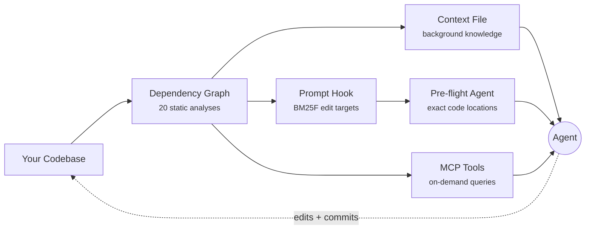

<h1 align="center"><br>Clarté</h1>
<p align="center"><em>/klaʁ.te/</em></p>

<p align="center">
  <a href="https://github.com/michaelabrt/clarte/actions/workflows/ci.yml"></a>
  <a href="https://www.npmjs.com/package/clarte"></a>
  <a href="https://www.typescriptlang.org/"></a>
  <a href="https://opensource.org/licenses/MIT"></a>
</p>

<p align="center"><strong>Architecture intelligence engine for agentic development.</strong></p>

Clarté builds a dependency graph from your codebase and uses it to steer tools like Claude Code, Cursor and Copilot - predicting where to edit before the agent starts exploring.

In [real-world tests](#case-studies), Clarté completed tasks that agents couldn't finish alone, at 26-50% lower cost.

```bash
npx clarte
```

Zero config. Detects your stack, scans source files, generates everything. Node.js 20+.

## Case Studies

The full Clarté stack (dependency graph + BM25F prompt targeting + pre-flight agent) on real bug fixes in open-source repos. Opaque prompts, Sonnet, `claude -p`:

| Task | Repo | Without Clarté | With Clarté |
|------|------|----------------|-------------|
| URL fragment stripping | Hono | 15 turns / $0.42 | **12 turns / $0.31** |
| JSX async context loss | Hono | did not finish | **17 turns / $0.48** |
| Form validator prototype pollution | Hono | did not finish | **18 turns / $0.41** |
| SQLite simple-enum array | TypeORM | ~22 turns | **~11 turns** |

Clarté completed 4 of 4. Without it, the agent completed 2 of 4 within the same budget. These are single-run pilot observations; for controlled evidence with statistical testing, see [fixture benchmarks](#fixture-benchmarks).

## What We Learned

We tested 20 approaches across 400+ sessions to find what actually changes agent behavior. Eighteen failed.

**What doesn't work:** giving agents more information. We ran 15 content experiments - richer analysis, better formatting, more sections. Zero wins. A [placebo](#placebo) (minimal context with project language and test framework, no structural analysis) performed identically to the full analysis. When we analyzed 170 sessions (7,595 turns), we found agents spend most of their time exploring code they never edit, and 75% of tail waste is test-retry loops where the agent re-runs the same failing command without changing code.

**What works:** telling agents where to edit. First-edit timing was the strongest predictor of session cost in our benchmarks (r=0.70-1.00 across 15 of 19 tasks; 4 tasks excluded due to ceiling effects where all sessions edited within 2 turns). Each turn before the first edit was associated with roughly 1.3 additional total turns. The bottleneck is not knowledge but confidence: agents can find files on their own; they lack a starting point.

So we built a system that gives the agent a starting point. The dependency graph makes the decision; the agent executes.

For the full research story (20 experiments, ablation studies, statistical methodology), see [docs/research.md](docs/research.md).

## How It Works

`npx clarte` parses your imports with tree-sitter, builds a dependency graph and runs 20 static analysis passes. The results are delivered through multiple mechanisms:

| Mechanism | When | What it does |
|-----------|------|--------------|
| [Context file](#output-targets) | Background | Architecture map for every session: key files, working guidelines, coupling patterns, conventions. Works with any tool that reads context files. |
| [Prompt targeting](#claude-code-integration) | Per prompt | BM25F retrieval over the dependency graph predicts edit targets on every prompt. A pre-flight agent reads those targets and returns exact code locations before the main agent writes a single line. |
| [Fail-fast hook](#claude-code-integration) | Per command | Blocks repeated test/build loops with no code edit in between. Addresses the #1 agent waste pattern (75% of tail turns in our analysis). |
| [MCP tools](#mcp-tools) | On demand | Four graph query tools for mid-session lookup: file scope, task routing, call graph and blast radius. |
| [Scripts](#generated-scripts) | Per task | Framework-aware test runner with structured output, filtered test-by-name runner and a grep wrapper that annotates results with graph context. |
| [GitHub Action](#github-action) | Per PR | Co-change warnings, chokepoint alerts and coupling concerns on pull requests. |



For details on each analysis algorithm (HITS, betweenness centrality, instability scoring, cycle detection, etc.), see [docs/how-it-works.md](docs/how-it-works.md).

## Fixture Benchmarks

Controlled benchmarks isolating context files alone (no hooks, no pre-flight). Same tasks, same model. Statistical testing with Wilcoxon signed-rank, bootstrap CIs, Benjamini-Hochberg FDR correction and Cliff's delta effect sizes.

**Claude Sonnet 4.6** - 9 opaque tasks across 3 TypeScript fixtures, 5 repetitions (135 sessions):

| Metric | Without Context | With Context | Delta | Significance |
|--------|----------------|--------------|-------|--------------|
| Cost (median) | $1.08 | **$0.45** | **-58.5%** | p<0.001, medium effect |
| Input tokens (median) | 272K | **108K** | **-60.4%** | p<0.001, large effect |
| Turns (median) | 16 | **11.5** | **-28.1%** | p<0.001, medium effect |
| Duration (median) | 130s | **98s** | **-24.8%** | p<0.001, small effect |
| Pass rate | 100% | 93% | -7pp | n.s. |

<a id="placebo"></a>

A placebo condition (minimal context with project language and test framework, no structural analysis) showed -1.3% cost (not significant, negligible effect), confirming the improvement comes from the analysis, not from having a system prompt.

The 7pp pass rate drop is not statistically significant at this sample size, but we are underpowered to rule out a small regression. Users should monitor pass rates in their own workloads.

**Claude Haiku 4.5** - 3 tasks, 7 repetitions (127 sessions):

| Metric | Without Context | With Context | Delta |
|--------|----------------|--------------|-------|
| Pass rate | 86% | **95%** | +9pp |
| Turns (median) | 19 | **14** | -26% (p<0.001) |
| Cost (median) | $0.35 | **$0.29** | -15% |

<details>
<summary><strong>Section ablation</strong></summary>

Exclude-based ablation on Haiku: remove one section at a time and measure the drop in pass rate.

| Removed Section | Pass Rate | Delta vs. Full Context |
|----------------|-----------|------------------------|
| _(none, full context)_ | 95% | -- |
| Key Files | 76% | **-19pp** |
| Conventions | 81% | **-14pp** |
| Test Mapping | 90% | -5pp |
| Working Guidelines | 91% | -4pp |
| _(all context removed)_ | 86% | -9pp |

Removing Key Files alone (-19pp) hurts more than removing all context (-9pp). One interpretation: the agent relies on knowing which files are central more than any other single piece of information. An alternative: removing one section while keeping others creates inconsistencies that hurt more than a clean slate. Exclude-based ablation cannot distinguish these.

</details>

Methodology, fixture projects and full reports are in the [benchmark repo](https://github.com/michaelabrt/clarte-benchmark).

## Claude Code Integration

For Claude Code, Clarté installs hooks and a pre-flight diagnostic agent on top of the context file. This is the full stack that produced the case study results.

**The flow:**

1. You submit a task prompt
2. The prompt hook runs BM25F retrieval over the dependency graph (file paths + AST symbol names), writes the top-5 predicted edit targets to `.clarte/task-context.md` with key symbols. Falls back to git history similarity when no graph is present.
3. The pre-agent hook blocks any subagent until the pre-flight scan has run
4. The pre-flight agent reads each target file exactly once and returns exact code locations with verbatim surrounding context and a proposed fix
5. The main agent's first action is an edit, not an exploration

| Component | Location | Purpose |
|-----------|----------|---------|
| Context file | `.claude/rules/clarte.md` | Architecture map, always loaded |
| Prompt hook | `.clarte/hooks/on-prompt.mjs` | BM25F target resolution on every prompt |
| Pre-agent hook | `.clarte/hooks/on-pre-agent.mjs` | Enforces pre-flight before other subagents |
| Fail-fast hook | `.clarte/hooks/on-fail-fast.mjs` | Blocks repeated test/build without a code edit (threshold: 3) |
| Session hook | `.clarte/hooks/on-session-start.mjs` | Resets hook state, disables hooks for Haiku |
| Pre-flight agent | `.claude/agents/clarte-pre-flight.md` | Reads targets, returns exact edit locations |

Hooks wire into `.claude/settings.json` automatically. The pre-flight agent is installed to your project's `.claude/agents/` directory.

> The pre-flight gate only fires when `.clarte/task-context.md` is present - when the prompt hook found matching targets. On repos without a graph, hooks are transparent.

## MCP Tools

The MCP server exposes the dependency graph for real-time queries during a session.

```json
{
  "mcpServers": {
    "clarte": {
      "command": "npx",
      "args": ["clarte", "--mcp"]
    }
  }
}
```

| Tool | What it does |
|------|-------------|
| `clarte_route` | Given a natural language task, finds the most relevant file from commit history via BM25 ranking. Designed as the first call before any exploration. |
| `clarte_scope` | Returns a file's role, importers, co-change partners, test file and first 150 lines with importer snippets. Call after finding a file to edit. |
| `clarte_calls` | Returns all call sites of a function (who calls it) and all functions it calls, with file paths and line numbers. Call before renaming or changing a signature. |
| `clarte_impact` | Returns every file that transitively depends on a given file (the blast radius), ranked by distance. Call before removing an export or changing a public type. |

## Generated Scripts

Clarté generates framework-aware shell scripts in `.clarte/scripts/`:

| Script | What it does |
|--------|-------------|
| `check-tests.sh` | Runs your test command and appends a structured one-line summary (pass/fail counts, failure names). Parses output for Vitest, Jest, Mocha and pytest. |
| `run-tests.sh` | Runs a filtered subset of tests by name pattern. Auto-detects compile steps and runs them first when needed. |
| `clarte-grep` | Wraps ripgrep and appends graph context (importers, co-change partners, test file) for each matching file. |

These are referenced in the generated context file with imperative directives ("Always use X instead of Y") so the agent uses them by default.

## Output Targets

Works with any AI coding tool that reads context files. Deep integration with Claude Code (hooks + pre-flight + MCP). Context file generation for everything else.

| Tool | Generated file |
|------|---------------|
| Claude Code | `.claude/rules/clarte.md` + hooks + pre-flight agent + MCP |
| Cursor | `.cursor/rules/clarte.mdc` + per-directory graph rules |
| OpenCode | `AGENTS.md` |
| GitHub Copilot | `.github/copilot-instructions.md` |
| Windsurf | `.windsurfrules` |
| Cline | `.clinerules` |
| Continue.dev | `.continuerules` |
| Generic | `CONTEXT.md` |

## Supported Languages

| Language | Import parsing | Snapshot extraction |
|----------|---------------|---------------------|
| TypeScript / JavaScript | `import`, `require` | types, interfaces, functions, components, hooks, stores |
| Python | `import`, `from ... import` | classes, functions, type aliases |
| Go | `import` | structs, interfaces, functions, methods |
| Rust | `use` | structs, enums, traits, functions |
| Java | `import` | classes, interfaces, enums, records, methods |

Multi-language projects handled automatically when a secondary language exceeds 15% of source files.

## GitHub Action

Reviews pull requests for architectural concerns: missing co-changes, structural hotspots and tight coupling.

```yaml
# .github/workflows/clarte.yml
name: Architecture Review
on: [pull_request]

jobs:
  review:
    runs-on: ubuntu-latest
    steps:
      - uses: actions/checkout@v4
        with:
          fetch-depth: 0
      - uses: michaelabrt/clarte@v1
        with:
          github-token: ${{ secrets.GITHUB_TOKEN }}
```

<details>
<summary><strong>Action inputs</strong></summary>

| Input | Default | Description |
|-------|---------|-------------|
| `github-token` | `${{ github.token }}` | GitHub token for posting PR comments |
| `working-directory` | `.` | Path to the project root |
| `comment-mode` | `update` | How to handle PR comments: `create`, `update` or `none` |
| `max-files` | `50` | Maximum changed files to analyze (0 = unlimited) |

</details>

<a id="options"></a>
<details>
<summary><strong>Options</strong></summary>

```bash
npx clarte [directory] [options]
```

| Flag | Description |
|------|-------------|
| `directory` | Path to analyze (defaults to `.`) |
| `-h, --help` | Show help message |
| `-V, --version` | Show version number |
| `--yes` | Overwrite existing files without asking |
| `--dry-run` | Preview what would be generated |
| `--diff[=REF] [FILES]` | Generate focused context for changed files (vs HEAD or REF) |
| `--diff-file=PATH` | Write diff output to a file instead of stdout |
| `--refresh-snapshot` | Re-scan source files and update just the code snapshot |
| `--reconfigure` | Re-prompt even if `.clarte.json` exists |
| `--check` | Check if the snapshot is stale via hash comparison (exit 0 = fresh, 1 = stale) |
| `--check=timestamp` | Timestamp-only staleness check, no file hashing (for shell hooks) |
| `--ci` | Machine-readable output (use with `--check` for CI pipelines) |
| `--max-tokens=N` | Set the token budget for the code snapshot |
| `--budget=N` | Set token budget for the context file (prioritized sections) |
| `--max-chars=N` | Set character budget (default: 39500, 0 to disable) |
| `--full` | Disable token budget (include all sections) |
| `--include=a,b` | Always include these sections (comma-separated IDs) |
| `--exclude=a,b` | Exclude these sections entirely |
| `--format=json` | Output full analysis as structured JSON to stdout |
| `--init-hook` | Install git pre-commit hook for auto-refresh on commit |
| `--watch` | Watch for file changes and re-analyze continuously |
| `--mcp` | Start the MCP server for real-time graph queries |
| `-v, --verbose` | Show detailed progress output |

**Subcommands:**

| Command | Description |
|---------|-------------|
| `ci --base=REF --changed-files=a,b` | Analyze changed files and output architectural findings as JSON |

</details>

<details>
<summary><strong>Configuration</strong></summary>

On first run, Clarté saves config to `.clarte.json` (add to `.gitignore`). Use `--reconfigure` to re-prompt.

| Field | Description |
|-------|-------------|
| `analysisDays` | Git history window in days (default: 90) |
| `staleDays` | Days before snapshot is considered stale (default: 7) |
| `sectionOrder` | Custom ordering of context sections; prefix with `-` to exclude |
| `layers` | Custom architectural layer patterns (regex, for hexagonal/clean/DDD architectures) |

**Monorepo support:** Detects pnpm workspaces, Turborepo and Nx. Per-package context files with scoped dependencies, frameworks and cross-package import analysis.

**Framework conventions:** Detects Next.js, Express, FastAPI, Django, NestJS, SvelteKit, Expo, Hono and more. Includes relevant conventions in the output.

**Context splitting:** Large projects (150+ files) automatically get tiered files: a root overview linking to per-directory context files in `.clarte/context/`.

**User section preservation:** Wrap custom content with `<!-- clarte:user-start -->` / `<!-- clarte:user-end -->` markers to survive regeneration.

</details>

## Development

```bash
npm install
npm run build      # Build with tsup
npm run dev        # Watch mode
npm run typecheck  # Type-check without emitting
npm test           # Run tests with vitest
```

## License

[MIT](LICENSE)
