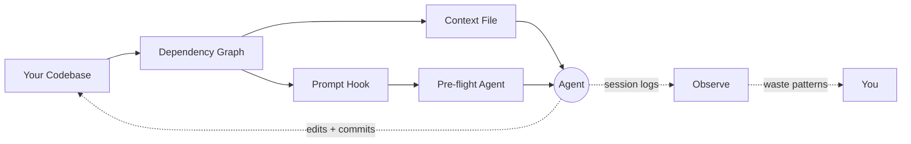

<h1 align="center"><br>Clarté</h1>
<p align="center"><em>/klaʁ.te/</em></p>

<p align="center">
  <a href="https://github.com/michaelabrt/clarte/actions/workflows/ci.yml"></a>
  <a href="https://www.npmjs.com/package/clarte"></a>
  <a href="https://www.typescriptlang.org/"></a>
  <a href="https://opensource.org/licenses/MIT"></a>
</p>

<p align="center"><strong>Edit first, explore never.</strong></p>

Clarté builds a dependency graph from your codebase and predicts which files need editing before the agent starts. In [real-world tests](#case-studies), it completed tasks agents couldn't finish alone, at 17-71% lower cost.

```bash
npx clarte            # set up pre-flight + hooks for your project
npx clarte observe    # see where your agent wastes time and money
```

Zero config. Detects your stack, scans source files, generates everything. Node.js 20+.

## What We Learned

We tested 30+ approaches across 700+ sessions to find what actually changes agent behavior. Over 80% failed.

**What doesn't work:** giving agents more information. We ran 15 content experiments - richer analysis, better formatting, more sections. Zero wins. A [placebo](#placebo) (minimal context with project language and test framework, no structural analysis) performed identically to the full analysis. When we analyzed 170 sessions (7,595 turns), we found agents spend most of their time exploring code they never edit, and 75% of tail waste is test-retry loops where the agent re-runs the same failing command without changing code.

**What works:** telling agents where to edit. First-edit timing was the strongest predictor of session cost in our benchmarks (r=0.70-1.00 across 15 of 19 tasks; 4 tasks excluded due to ceiling effects where all sessions edited within 2 turns). Each turn before the first edit was associated with roughly 1.3 additional total turns. The bottleneck is not knowledge but confidence: agents can find files on their own; they lack a starting point.

So we built a system that gives the agent a starting point. The dependency graph makes the decision; the agent executes.

For the full research story (30+ experiments, ablation studies, statistical methodology), see [docs/research.md](docs/research.md).

## Case Studies

Real bug fixes in open-source repos. Opaque prompts, Sonnet, `claude -p`:

| Task | Repo | Without Clarté | With Clarté | n | Stack |
|------|------|----------------|-------------|---|-------|
| URL fragment stripping | Hono | $0.34 avg | **$0.28 avg (-17%)** | 8+8 | pre-flight |
| JSX async context loss | Hono | did not finish | **$0.64 avg** | 2+2 | pre-flight |
| Form validator prototype pollution | Hono | did not finish | **18 turns / $0.41** | 1+1 | pre-flight |
| SQLite simple-enum array | TypeORM | 47.7 turns / $1.47 | **16.3 turns / $0.43 (-71%)** | 3+3 | pre-flight |
| WebSocket adapter shutdown | NestJS | 53 turns / $2.70 | **38 turns / $2.17 (-20%)** | 7+7 | context file |

**Stack**: *pre-flight* = dependency graph + BM25F prompt targeting + pre-flight agent. *context file* = dependency graph + generated context file (no pre-flight).

Clarté completed 5 of 5. Without it, the agent completed 3 of 5 within the same budget. The URL fragment, TypeORM and WebSocket rows are pooled from multiple controlled runs; JSX and form validator include single-run pilots with follow-up ABs. For controlled evidence with statistical testing, see [fixture benchmarks](#fixture-benchmarks).

## How It Works

`npx clarte` parses your imports with tree-sitter, builds a dependency graph and runs static analysis. Three mechanisms work together:

**Steer** - predict edit targets and stop waste loops:

| Component | When | What it does |
|-----------|------|--------------|
| [Pre-flight agent](#claude-code-integration) | Per prompt | BM25F retrieval over the dependency graph predicts edit targets. A pre-flight agent reads those targets and returns exact code locations before the main agent writes a single line. |
| [Fail-fast hook](#claude-code-integration) | Per tool call | Blocks repeated test/build loops with no code edit in between. Addresses the #1 agent waste pattern (75% of tail turns in our analysis). |
| [Context file](#claude-code-integration) | Background | Minimal operational directives: tech stack, config constraints, dev commands, test scripts. |
| [Scripts](#generated-scripts) | On demand | Framework-aware test runner with structured output, filtered test-by-name runner and a grep wrapper with graph context. |

**Observe** - measure what the agent actually does:

```bash
$ npx clarte observe --all

19 sessions analyzed

Averages (per session)
  Turns:        48.2
  Cost:         $4.04
  First edit:   turn 16.5

Phase Distribution
  Explore:  51%
  Edit:     26%
  Tail:     23%

Waste
  Total:    $10.05 of $76.83 (13%)
  Per session: $0.53
```

Parses Claude Code session logs, classifies turns into explore/edit/tail phases, detects waste patterns (test reruns, verification re-reads, summary bloat) and computes cost metrics.



## Fixture Benchmarks

<a id="fixture-benchmarks"></a>

Controlled benchmarks isolating context files alone (no hooks, no pre-flight). Same tasks, same model. Statistical testing with Wilcoxon signed-rank, bootstrap CIs, Benjamini-Hochberg FDR correction and Cliff's delta effect sizes.

**Claude Sonnet 4.6** - 9 opaque tasks across 3 TypeScript fixtures, 5 repetitions (135 sessions):

| Metric | Without Context | With Context | Delta | Significance |
|--------|----------------|--------------|-------|--------------|
| Cost (median) | $1.08 | **$0.45** | **-58.5%** | p<0.001, medium effect |
| Input tokens (median) | 272K | **108K** | **-60.4%** | p<0.001, large effect |
| Turns (median) | 16 | **11.5** | **-28.1%** | p<0.001, medium effect |
| Duration (median) | 130s | **98s** | **-24.8%** | p<0.001, small effect |
| Pass rate | 100% | 93% | -7pp | n.s. |

<a id="placebo"></a>

A placebo condition (minimal context with project language and test framework, no structural analysis) showed -1.3% cost (not significant, negligible effect), confirming the improvement comes from the analysis, not from having a system prompt.

The 7pp pass rate drop is not statistically significant at this sample size, but we are underpowered to rule out a small regression. Users should monitor pass rates in their own workloads.

**Claude Haiku 4.5** - 3 tasks, 7 repetitions (127 sessions):

| Metric | Without Context | With Context | Delta |
|--------|----------------|--------------|-------|
| Pass rate | 86% | **95%** | +9pp |
| Turns (median) | 19 | **14** | -26% (p<0.001) |
| Cost (median) | $0.35 | **$0.29** | -15% |

Methodology, fixture projects and full reports are in the [benchmark repo](https://github.com/michaelabrt/clarte-benchmark).

## Claude Code Integration

For Claude Code, Clarté installs hooks and a pre-flight diagnostic agent on top of the context file. This is the full stack that produced the case study results.

**The flow:**

1. You submit a task prompt
2. The prompt hook checks whether the prompt already mentions file paths from the dependency graph. If it does, the agent already knows where to edit - steps 3-4 are skipped (zero overhead).
3. Otherwise, the hook runs BM25F retrieval over the graph (file paths + AST symbol names), writes the top-5 predicted edit targets to `.clarte/task-context.md` with key symbols and installs the pre-flight agent. Falls back to git history similarity when no graph is present.
4. The pre-flight agent reads each target file exactly once and returns exact code locations with verbatim surrounding context and a proposed fix
5. The main agent's first action is an edit, not an exploration

| Component | Location | Purpose |
|-----------|----------|---------|
| Context file | `.claude/rules/clarte.md` | Operational directives, always loaded |
| Prompt hook | `.clarte/hooks/on-prompt.mjs` | BM25F target resolution on every prompt |
| Fail-fast hook | `.clarte/hooks/on-fail-fast.mjs` | Blocks repeated test/build without a code edit (threshold: 3) |
| Session hook | `.clarte/hooks/on-session-start.mjs` | Resets hook state, disables hooks for Haiku |
| Pre-flight agent | `.clarte/agents/clarte-pre-flight.md` | Reads targets, returns exact edit locations |

Hooks wire into `.claude/settings.json` automatically. The pre-flight agent is stored in `.clarte/agents/` and copied to `.claude/agents/` only when the prompt hook detects an opaque task.

Also generates context files for Cursor, Copilot, Windsurf, Cline, Continue and OpenCode (context file only, no hooks or steering).

## Generated Scripts

Clarté generates framework-aware shell scripts in `.clarte/scripts/`:

| Script | What it does |
|--------|-------------|
| `check-tests.sh` | Runs your test command and appends a structured one-line summary (pass/fail counts, failure names). Parses output for Vitest, Jest, Mocha and pytest. |
| `run-tests.sh` | Runs a filtered subset of tests by name pattern. Auto-detects compile steps and runs them first when needed. |
| `clarte-grep` | Wraps ripgrep and appends graph context (importers, co-change partners, test file) for each matching file. |

These are referenced in the generated context file with imperative directives ("Always use X instead of Y") so the agent uses them by default.

## Supported Languages

| Language | Import parsing | Snapshot extraction |
|----------|---------------|---------------------|
| TypeScript / JavaScript | `import`, `require` | types, interfaces, functions, components, hooks, stores |
| Python | `import`, `from ... import` | classes, functions, type aliases |
| Go | `import` | structs, interfaces, functions, methods |
| Rust | `use` | structs, enums, traits, functions |
| Java | `import` | classes, interfaces, enums, records, methods |

Multi-language projects handled automatically when a secondary language exceeds 15% of source files.

<details>
<summary><strong>GitHub Action (work in progress)</strong></summary>

There's an experimental GitHub Action that reviews PRs for missing co-changes and structural hotspots. It works but the signal-to-noise ratio needs improvement - most findings are technically correct but not actionable yet. Use at your own discretion.

```yaml
- uses: michaelabrt/clarte@v1
  with:
    github-token: ${{ secrets.GITHUB_TOKEN }}
```

</details>

<a id="options"></a>
<details>
<summary><strong>CLI reference</strong></summary>

```bash
npx clarte [directory] [options]
```

**Subcommands:**

| Command | Description |
|---------|-------------|
| `init` | Set up Clarté for a project (default if no subcommand) |
| `observe` | Analyze Claude Code session logs for waste patterns |
| `ci` | Analyze changed files and output architectural findings as JSON |

**Init options:**

| Flag | Description |
|------|-------------|
| `--yes` | Overwrite existing files without asking |
| `--dry-run` | Preview what would be generated |
| `--reconfigure` | Re-prompt even if `.clarte.json` exists |
| `--refresh-snapshot` | Re-scan source files and update just the code snapshot |
| `--format=json` | Output full analysis as structured JSON to stdout |
| `--init-hook` | Install git pre-commit hook for auto-refresh on commit |
| `-v, --verbose` | Show detailed progress output |

**Observe options:**

| Flag | Description |
|------|-------------|
| `--session=ID` | Analyze a specific session |
| `--all` | Search all projects, not just current |
| `--since=7d` | Time window (d/h/m/w) |
| `--format=json` | Machine-readable JSON output |

**Check options:**

| Flag | Description |
|------|-------------|
| `--check` | Exit 0 if snapshot is fresh, 1 if stale (hash-based) |
| `--check=timestamp` | Timestamp-only staleness check (for shell hooks) |
| `--ci` | Machine-readable output (use with `--check` for CI pipelines) |

**CI options:**

| Flag | Description |
|------|-------------|
| `--base=REF` | Git ref to diff against (default: HEAD) |
| `--changed-files=a,b` | Explicit list of changed files (comma-separated) |

</details>

<details>
<summary><strong>Configuration</strong></summary>

On first run, Clarté saves config to `.clarte.json` (add to `.gitignore`). Use `--reconfigure` to re-prompt.

| Field | Description |
|-------|-------------|
| `analysisDays` | Git history window in days (default: 90) |
| `staleDays` | Days before snapshot is considered stale (default: 7) |
| `layers` | Custom architectural layer patterns (regex, for hexagonal/clean/DDD architectures) |

**Monorepo support:** Detects pnpm workspaces, Turborepo and Nx. Per-package context files with scoped dependencies, frameworks and cross-package import analysis.

**Framework conventions:** Detects Next.js, Express, FastAPI, Django, NestJS, SvelteKit, Expo, Hono and more. Includes relevant conventions in the output.

**User section preservation:** Wrap custom content with `<!-- clarte:user-start -->` / `<!-- clarte:user-end -->` markers to survive regeneration.

</details>

## Development

```bash
bun install
bun run build      # Build with tsup
bun run dev        # Watch mode
bun run typecheck  # Type-check without emitting
bun test           # Run tests with vitest
```

## License

[MIT](LICENSE)
