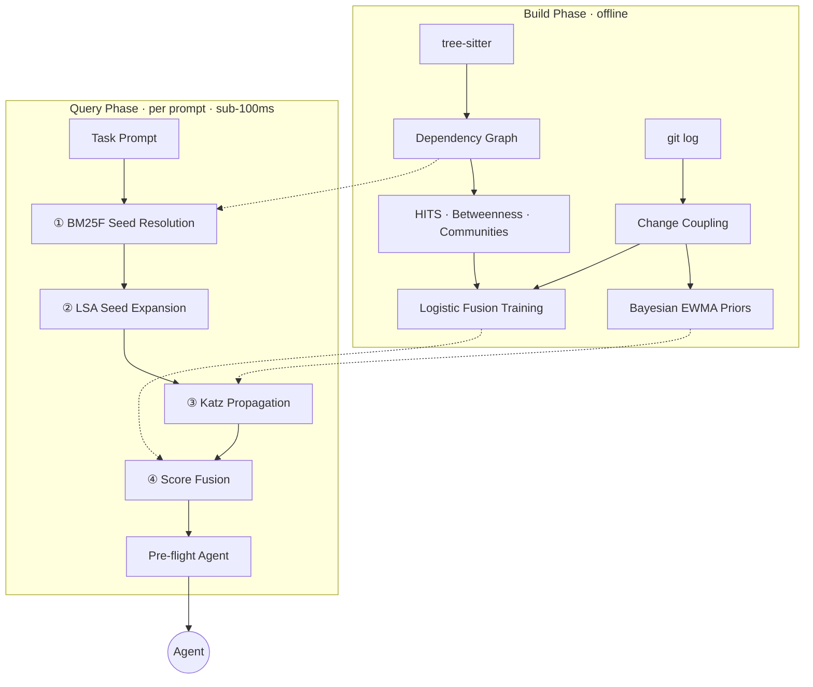

<h1 align="center"><br>Clarté</h1>
<p align="center"><em>/klaʁ.te/</em></p>

<p align="center">
  <a href="https://github.com/michaelabrt/clarte/actions/workflows/ci.yml"></a>
  <a href="https://www.npmjs.com/package/@michaelabrt/clarte"></a>
  <a href="https://www.typescriptlang.org/"></a>
  <a href="https://fsl.software"></a>
</p>

<p align="center"><strong>Structural intuition for coding agents.</strong></p>

Your agent spends ~60% of its turns reading files it will never edit. Clarté predicts which files need editing and tells the agent to start there. The agent's first action becomes an edit, not a file read.

```bash
npx @michaelabrt/clarte
```

Zero config. Detects your stack, builds a dependency graph, generates hooks. Sub-100ms inference on every prompt. Node.js 24+.

---

Five real bug fixes in open-source repos. Opaque prompts, Claude Sonnet, `claude -p`:

| Task | Repo | Without Clarté | With Clarté | n |
|------|------|----------------|-------------|---|
| JSX async context loss | Hono | wrong file, did not finish | **correct file, 2 min to first edit** | 2+2 |
| Form validator prototype pollution | Hono | did not finish | **completed (18 turns)** | 1+1 |
| SQLite simple-enum array | TypeORM | 47.7 turns | **16.3 turns (-66%)** | 3+3 |
| WebSocket adapter shutdown | NestJS | 53 turns | **38 turns (-28%)** | 7+7 |
| URL fragment stripping | Hono | completed, high variance | **completed, 3x more consistent** | 8+8 |

Clarté completed 5/5. Without it, the agent completed 3/5 within the same budget.

## Confidence > Information

We ran 30+ experiments across 700+ agent sessions to find what changes agent behavior. Not what seems like it should help. What measurably, reproducibly helps.

First, we measured how agents spend their time. 170 sessions, 7,595 turns. Result: 59% of turns reading files the agent never edits. 13% re-running tests with no code change. Only 28% of a session is actual work.

We assumed the fix was better information. So we built 15 context enrichments: instability metrics, facade maps, API surfaces, type-aware ordering, task-relevant weighting. Each benchmarked in isolation and combination.

**Zero wins.** Not one survived our combinatorial benchmark at realistic temperature.

Then we found the placebo. A minimal context file - just the project language and test framework, two lines, zero analysis - performed identically to our full 2,000-token enrichment. The content was irrelevant. The file's existence alone suppressed the agent's exploration phase.

The real signal turned out to be **first-edit timing**. Correlation with session length: r = 0.70 to 1.00 across 15/19 tasks. Each delayed turn adds ~1.3 total turns. With context, agents start editing at turn 5. Without, turn 8. They find the right files on their own given enough time. They just lack the confidence to stop reading and start editing.

So we stopped injecting information. We started injecting confidence.

> Not "this file has 49 importers and is a structural chokepoint."
> Instead: **"Edit `src/jsx/context.ts`. Start now."**

The graph makes the decision. The agent executes. For the full research story, see [docs/research.md](docs/research.md).

## ELI5 (or maybe slightly more)

Clarté parses your source code with [tree-sitter](https://tree-sitter.github.io/tree-sitter/) and builds a weighted dependency graph from imports, call sites and git history. On every prompt, four stages run in sequence: BM25F seed resolution finds lexically matching files; LSA expansion adds structurally related neighbors; Katz centrality propagates relevance through the import graph; and logistic fusion, trained on your commit patterns, produces a final ranking. Optional semantic search (snowflake-arctic-embed-xs) fuses with BM25F via reciprocal rank fusion when available. The top predictions go to a pre-flight agent that reads each file once and returns exact edit locations.

The full query pipeline runs in under 100ms. The [Architecture](#architecture) section has the math.

## What Clarté is NOT

**Not a RAG system.** Clarté has embeddings (snowflake-arctic-embed-xs) and hybrid search (BM25F + semantic + RRF fusion), but retrieval is just one input. The output isn't "here are relevant code snippets" - it's a ranked prediction of which files to edit, derived from graph analysis, git history and retrieval signals combined.

**Not just a search tool.** It exposes `clarte_find` for "where is the code that does X?" queries, but search is a side effect. The primary job is prediction: ranking files by edit probability before the agent starts exploring.

**Not a framework.** No SDK, no API, no integration code. One command generates everything. Works with Claude Code, Cursor, Copilot, Windsurf, Cline and OpenCode.

**Not prompt engineering.** The prediction comes from dependency graphs, Katz centrality, Markov flow analysis and logistic fusion trained on your commit patterns. The graph makes the decision, not the LLM.

## Benchmarks

Controlled benchmarks isolating context files alone (no hooks, no pre-flight). Same tasks, same model. Statistical testing with Wilcoxon signed-rank, bootstrap CIs, Benjamini-Hochberg FDR correction and Cliff's delta effect sizes.

**Claude Sonnet 4.6** - 9 opaque tasks across 3 TypeScript fixtures, 5 repetitions (135 sessions):

| Metric | Without Context | With Context | Delta | Significance |
|--------|----------------|--------------|-------|--------------|
| Wall-clock time (median) | 130s | **98s** | **-25%** | p<0.001, small effect |
| Turns (median) | 16 | **11.5** | **-28%** | p<0.001, medium effect |
| Input tokens (median) | 272K | **108K** | **-60%** | p<0.001, large effect |
| Pass rate | 100% | 93% | -7pp | n.s. |

60% fewer input tokens per turn. A placebo condition (language + test framework only, no structural analysis) showed no significant improvement, confirming the gains come from graph analysis.

The 7pp pass rate drop is not significant at this sample size, but we are underpowered to rule out a small regression. Monitor pass rates in your own workloads.

**Claude Haiku 4.5** - 3 tasks, 7 repetitions (127 sessions):

| Metric | Without Context | With Context | Delta |
|--------|----------------|--------------|-------|
| Pass rate | 86% | **95%** | **+9pp** |
| Turns (median) | 19 | **14** | -26% (p<0.001) |

Haiku shows a correctness gain: +9pp pass rate with 26% fewer turns.

Methodology, fixture projects and full reports are in the [benchmark repo](https://github.com/michaelabrt/clarte-benchmark).

## Architecture



### Stage 1: Seed Expansion

You submit a task: "fix the JWT session leak." Two problems need solving.

**Lexical matching.** The query tokens "JWT" and "session" should match files like `auth/jwt.ts` or `session/manager.ts`. Clarté runs true multi-field BM25F (Robertson et al. 2004) across three document fields: file path segments, exported symbol names and import statements, each with independent length normalization and field weights.

Path segments are weighted 2x higher than symbols. `auth/middleware.ts` tells you more about a session-handling bug than a function named `validate`. Import names get 0.5x because they signal consumption, not definition. The query is tokenized with camelCase splitting, compound-word preservation and domain-specific synonym expansion (`auth` → `authentication`, `db` → `database`). IDF is computed globally across the corpus.

<details>
<summary><strong>Definitely not ELI5</strong></summary>

Each query term's IDF is weighted by a saturated pseudo-term-frequency that blends all three fields before applying the `k₁ = 1.2` saturation constant. The weighted pseudo-term-frequency combines all three fields before saturation (true BM25F, not per-field BM25+).

$$\text{score}(d, q) = \sum_{t \in q} \text{IDF}(t) \cdot \frac{\widetilde{tf}(t, d)}{\widetilde{tf}(t, d) + k_1}$$

$$\widetilde{tf}(t, d) = \sum_{f \in \lbrace \text{path, sym, imp} \rbrace} w_f \cdot \frac{tf_{f}(t, d)}{1 - b_f + b_f \cdot |d_f| \, / \, \overline{dl}_f}$$

</details>

Three post-processing steps refine the candidate set: spreading activation propagates scores along import edges for 3 hops with 0.5^(hop-1) decay; test proxy scoring transfers test file scores to their source files at 0.6x (test paths encode what they cover); and an import ceiling caps re-export barrels at 0.5x the minimum direct-match score.

**Conceptual matching.** BM25F will never connect a bug report about "session tokens" to a file named `SessionGuard.ts` that exports `validateJWT`. No surface tokens overlap.

Latent Semantic Analysis bridges this gap. We build a file-symbol incidence matrix and compute a rank-32 approximation via randomized truncated SVD (Halko-Martinsson-Tropp algorithm). Files project into a 32-dimensional latent space where cosine similarity captures shared structural role rather than shared tokens.

The top BM25F seeds are averaged into a centroid vector. Non-seed files within cosine distance 0.3 enter the candidate pool at 0.4x discount, expanding the set with up to 5 conceptually related files. Activates only on codebases with 50+ files; below that, BM25F alone has sufficient coverage.

Sub-millisecond for typical codebases (1,000 files, 20 imports/file).

<details>
<summary><strong>Definitely not ELI5: parameters and SVD pipeline</strong></summary>

| Parameter | Value | Role |
|-----------|-------|------|
| k₁ | 1.2 | Saturation constant |
| w_path | 2.0 | Path field weight |
| w_sym | 1.0 | Symbol field weight |
| w_imp | 0.5 | Import field weight |
| b_path | 0.3 | Path length normalization |
| b_sym | 0.4 | Symbol length normalization |
| b_imp | 0.5 | Import length normalization |

**Spreading activation:** 3 hops, 0.5^(hop-1) decay. Importers 0.4x, imports 0.2x, co-change partners 0.4x.

**Test proxy scoring:** transfers test file BM25F scores to source files at 0.6x.

**Import ceiling:** caps import-only files at 0.5x the minimum path/symbol score.

**Randomized SVD pipeline:**

1. Build sparse file-symbol incidence matrix M (CSR format)
2. Generate random Gaussian Ω ∈ ℝⁿˣ⁽ᵏ⁺ᵖ⁾ where k=32 (rank), p=10 (oversampling)
3. Form Y = MΩ, then 2 power iterations: Y ← M(Mᵀ Y)
4. QR decomposition Y = QR via modified Gram-Schmidt
5. Project: B = Qᵀ M (small dense matrix)
6. Jacobi eigendecomposition of BBᵀ for singular values and left vectors
7. File embeddings: U = Q · U_B · diag(S)

</details>

### Stage 2: Intent Propagation

BM25F and LSA found the seed files. The bug might live one or two imports away. The obvious approach is shortest-path traversal, but shortest paths miss consensus.

If a file is reachable from the seed set through three independent import chains, it is more likely relevant than a file reachable through one. Dijkstra sees only the single best path. The other two, each carrying independent evidence, are discarded. That throws away the strongest signal in the graph.

Katz centrality captures this. It computes the weighted sum of *all* walks from the seed set, with exponential decay per hop. The attenuation factor α is set to 85% of 1/ρ(A), where ρ(A) is the spectral radius of the weighted adjacency matrix (estimated via 10 power iterations). This guarantees convergence while maximizing the contribution of longer paths.

<details>
<summary><strong>Definitely not ELI5</strong></summary>

$$\mathbf{x}_{k+1} = \alpha \, A^T \mathbf{x}_k + \mathbf{s}$$

Edge weights fuse four signals: edge kind (call 0.7, extends 0.8, type-only 0.3), co-change confidence from Bayesian EWMA priors, directionality (reverse edges at 0.7x) and ghost status (inferred edges at 0.6x). Converges when the L2 norm of the update falls below 10⁻⁶ or after 50 iterations. O(|E|) per iteration on sparse representation.

</details>

After Katz converges, a second pass re-propagates from chokepoints (files above the 75th percentile of betweenness centrality) for one additional hop, amplifying structural bottlenecks that all paths must traverse.

### Stage 3: Execution Tracing

Import graphs show static structure. Runtime follows different paths. A function might import ten modules but only call three during execution. Import analysis alone cannot distinguish.

Clarté extracts a symbol-level call graph from the AST and models it as an absorbing Markov chain. Each symbol is a state. Symbols with no outgoing calls are absorbing states. Transition probabilities fuse four factors: edge kind weight, coupling confidence, HITS authority of the target (raised to 0.7 to soften dominance) and days since last co-change (exponential decay with ~90-day half-life).

<details>
<summary><strong>Definitely not ELI5</strong></summary>

$$w(u, v) = s(\text{kind}) \cdot c \cdot \alpha(v)^{0.7} \cdot e^{-0.033\,\Delta t}$$

where *s* is the edge kind weight, *c* is coupling confidence, *α(v)* is HITS authority and *Δt* is days since last co-change.

Cross-community utility sinks (loggers, formatters) with indegree ≥ 5 receive a 0.05x penalty via information-theoretic attenuation. The ratio of directed indegree to outdegree distinguishes legitimate hubs from infrastructure drains, keeping probability flowing through domain logic rather than pooling in shared utilities.

Forward propagation from entry points produces a flow signature: visited states with absorption probabilities, residual mass and convergence steps. The system reconstructs up to 5 diverse shortest paths (Yen's algorithm) and identifies dominator waypoints that all execution paths must traverse.

</details>

### Stage 4: Adaptive Learning

Hardcoded weights assume every repository has the same coupling patterns. They don't. A monorepo with 200 packages and a single-file CLI tool need fundamentally different signal blending. Clarté learns per-repository weights from two sources.

**Bayesian EWMA Edge Priors.** Each import edge carries a Beta(α, β) distribution modeling co-change probability. Priors initialize from structural properties: direct value import at 0.7, barrel-routed at 0.5, dynamic at 0.4, type-only at 0.3. On each git commit, affected edges update via exponential weighted moving average with 0.995 per-commit decay. The posterior mean `E[w] = α / (α + β)` feeds directly into Katz edge weights and Markov transition probabilities, giving recently co-changed edges higher traversal probability.

<details>
<summary><strong>Definitely not ELI5</strong></summary>

**Logistic Score Fusion.** For each of the 500 most recent multi-file commits, the system extracts four features per candidate:

| Feature | Signal |
|---------|--------|
| L | Path token Jaccard similarity (lexical proximity) |
| G | 1 / (BFS distance + 1) via multi-source BFS (graph proximity) |
| T | Maximum change coupling confidence (temporal co-change) |
| B | Normalized betweenness centrality (structural importance) |

Hard negatives are mined from three tiers: direct imports, same Leiden community and 2-hop neighbors. L2-regularized logistic regression (λ = 0.01) learns repository-specific fusion weights via batch gradient descent. Repositories with fewer than 30 commits fall back to empirically tuned defaults (λ_L = 0.35, λ_G = 0.35, λ_T = 0.15, λ_B = 0.15). Training completes in under 50ms for 500 commits on a 1,000-file graph.

$$P(\text{co-change} \mid \mathbf{x}) = \sigma(\boldsymbol{\lambda}^T \mathbf{x}) = \frac{1}{1 + e^{-\boldsymbol{\lambda}^T \mathbf{x}}}$$

</details>

<details>
<summary><strong>Definitely not ELI5: supporting infrastructure</strong></summary>

Three systems provide the edge weights and structural features consumed by the stages above.

**HITS Authority/Hub Scoring.** Hyperlink-Induced Topic Search with teleportation smoothing (α = 0.15) computes per-file authority and hub scores. Authority identifies foundational files (heavily imported); hub identifies orchestrators (many outgoing imports). Barrel files receive a 0.3x authority discount. Edge weights account for import specificity (`log₂(nameCount+1) / log₂(6)`), type-only discount (0.7x) and dynamic import discount (0.5x). These scores feed into Markov transition weights, file role classification and the betweenness centrality features used in logistic fusion.

**Leiden Communities.** Community detection partitions the graph into densely connected clusters. Used for stratified sampling in betweenness centrality (one representative per community guarantees no blind spots), cross-community transition detection in execution flow tracing and hard negative mining in logistic fusion training.

**Betweenness Centrality.** Sampled Brandes algorithm with deterministic seeded PRNG for reproducibility. k = max(50, 2√|V|), stratified by Leiden community. Identifies structural chokepoints used in Katz phase-2 seeding and as features in logistic fusion.

</details>

### The Latency Budget

After scoring, the top predicted files are assembled into a task context with key symbols per file. A pre-flight agent reads each target once and returns exact edit locations with surrounding code. The main agent's first action is an edit, not an exploration.

**The complete query pipeline runs in under 100ms on a standard laptop.** Graph construction, HITS scoring, community detection and logistic training execute once during `npx @michaelabrt/clarte` and cache in SQLite. The per-prompt path touches only the pre-computed graph.

---

<details>
<summary><strong>Claude Code Integration</strong></summary>

For Claude Code, Clarté installs hooks and a pre-flight diagnostic agent on top of the context file. This is the full stack that produced the case study results.

**The flow:**

1. You submit a task prompt
2. The prompt hook checks whether the prompt already mentions file paths from the dependency graph. If it does, the agent already knows where to edit - steps 3-4 are skipped (zero overhead)
3. Otherwise, the hook runs BM25F retrieval over the graph (file paths + AST symbol names), writes the top-5 predicted edit targets to `.clarte/task-context.md` with key symbols and installs the pre-flight agent. Falls back to git history similarity when no graph is present
4. The pre-flight agent reads each target file exactly once and returns exact code locations with verbatim surrounding context and a proposed fix
5. The main agent's first action is an edit, not an exploration

| Component | Location | Purpose |
|-----------|----------|---------|
| Context file | `.claude/rules/clarte.md` | Operational directives, always loaded |
| Prompt hook | `.clarte/hooks/on-prompt.mjs` | BM25F target resolution on every prompt |
| Fail-fast hook | `.clarte/hooks/on-fail-fast.mjs` | Blocks repeated test/build without a code edit (threshold: 3) |
| Session hook | `.clarte/hooks/on-session-start.mjs` | Resets hook state, disables hooks for Haiku |
| Pre-flight agent | `.clarte/agents/clarte-pre-flight.md` | Reads targets, returns exact edit locations |

Hooks wire into `.claude/settings.json` automatically. The pre-flight agent is stored in `.clarte/agents/` and copied to `.claude/agents/` only when the prompt hook detects an opaque task.

Also generates context files for Cursor, Copilot, Windsurf, Cline, Continue and OpenCode (context file only, no hooks or steering).

</details>

<details>
<summary><strong>Generated Scripts</strong></summary>

Clarté generates framework-aware shell scripts in `.clarte/scripts/`:

| Script | What it does |
|--------|-------------|
| `check-tests.sh` | Runs your test command and appends a structured one-line summary (pass/fail counts, failure names). Parses output for Vitest, Jest, Mocha and pytest. |
| `run-tests.sh` | Runs a filtered subset of tests by name pattern. Auto-detects compile steps and runs them first when needed. |
| `clarte-grep` | Wraps ripgrep and appends graph context (importers, co-change partners, test file) for each matching file. |

These are referenced in the generated context file with imperative directives ("Always use X instead of Y") so the agent uses them by default.

</details>

<details>
<summary><strong>Supported Languages</strong></summary>

| Language | Import parsing | Snapshot extraction |
|----------|---------------|---------------------|
| TypeScript / JavaScript | `import`, `require` | types, interfaces, functions, components, hooks, stores |
| Python | `import`, `from ... import` | classes, functions, type aliases |
| Go | `import` | structs, interfaces, functions, methods |
| Rust | `use` | structs, enums, traits, functions |
| Java | `import` | classes, interfaces, enums, records, methods |

Multi-language projects handled automatically when a secondary language exceeds 15% of source files.

</details>

<details>
<summary><strong>CLI Reference</strong></summary>

```bash
npx @michaelabrt/clarte [directory] [options]
```

**Subcommands:**

| Command | Description |
|---------|-------------|
| `init` | Set up Clarté for a project (default if no subcommand) |
| `observe` | Analyze Claude Code session logs for waste patterns |
| `ci` | Analyze changed files and output architectural findings as JSON |

**Init options:**

| Flag | Description |
|------|-------------|
| `--yes` | Overwrite existing files without asking |
| `--dry-run` | Preview what would be generated |
| `--reconfigure` | Re-prompt even if `.clarte.json` exists |
| `--refresh-snapshot` | Re-scan source files and update just the code snapshot |
| `--format=json` | Output full analysis as structured JSON to stdout |
| `--init-hook` | Install git pre-commit hook for auto-refresh on commit |
| `-v, --verbose` | Show detailed progress output |

**Observe options:**

| Flag | Description |
|------|-------------|
| `--session=ID` | Analyze a specific session |
| `--all` | Search all projects, not just current |
| `--since=7d` | Time window (d/h/m/w) |
| `--format=json` | Machine-readable JSON output |

**Check options:**

| Flag | Description |
|------|-------------|
| `--check` | Exit 0 if snapshot is fresh, 1 if stale (hash-based) |
| `--check=timestamp` | Timestamp-only staleness check (for shell hooks) |
| `--ci` | Machine-readable output (use with `--check` for CI pipelines) |

**CI options:**

| Flag | Description |
|------|-------------|
| `--base=REF` | Git ref to diff against (default: HEAD) |
| `--changed-files=a,b` | Explicit list of changed files (comma-separated) |

</details>

<details>
<summary><strong>Configuration</strong></summary>

On first run, Clarté saves config to `.clarte.json` (add to `.gitignore`). Use `--reconfigure` to re-prompt.

| Field | Description |
|-------|-------------|
| `analysisDays` | Git history window in days (default: 90) |
| `staleDays` | Days before snapshot is considered stale (default: 7) |
| `layers` | Custom architectural layer patterns (regex, for hexagonal/clean/DDD architectures) |

**Monorepo support:** Detects pnpm workspaces, Turborepo and Nx. Per-package context files with scoped dependencies, frameworks and cross-package import analysis.

**Framework conventions:** Detects Next.js, Express, FastAPI, Django, NestJS, SvelteKit, Expo, Hono and more. Includes relevant conventions in the output.

**User section preservation:** Wrap custom content with `<!-- clarte:user-start -->` / `<!-- clarte:user-end -->` markers to survive regeneration.

</details>

<details>
<summary><strong>GitHub Action (work in progress)</strong></summary>

There's an experimental GitHub Action that reviews PRs for missing co-changes and structural hotspots. It works but the signal-to-noise ratio needs improvement. Most findings are technically correct but not actionable yet.

```yaml
- uses: michaelabrt/clarte@v1
  with:
    github-token: ${{ secrets.GITHUB_TOKEN }}
```

</details>

## Development

```bash
bun install
bun run build      # Build with tsup
bun run dev        # Watch mode
bun run typecheck  # Type-check without emitting
bun test           # Run tests with vitest
```

## License

[FSL-1.1-MIT](LICENSE) - free to use, modify and distribute. The only restriction is competing use (building a product whose primary utility overlaps with Clarté's core functionality). Converts to MIT on March 17, 2028.
